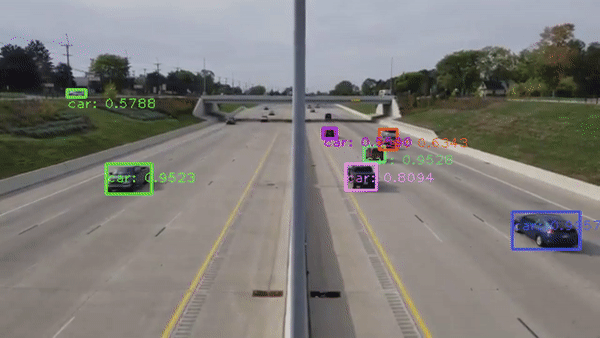

[](https://www.python.org/)
[](https://github.com/ellerbrock/open-source-badges/)
[](http://perso.crans.org/besson/LICENSE.html)


# Analyse d'image par IA : Utilisation de Yolov4

*Ne disposant pas des droits des vidéos, ce dépôt open-source n'en fournit donc pas*



## Sommaire

- [Installation avec Anaconda](#installation-avec-anaconda)
- [Utilisation](#utilisation)
    * [Traiter une vidéo](#traiter-une-vidéo)
    * [Restituer une analyse](#restituer-une-analyse)
- [Crédits](#crédits)
- [Déclarer un bug](#déclarer-un-bug)

## Installation avec Anaconda

1. Créer un environnement virtuel vide

```
conda create -n myenv python pip --no-default-packages
```

2. Installer les dépendances
```
pip install -r requirements.txt
```

3. Télécharger les fichiers de Yolov4 à la racine du dossier

- **cfg** : https://github.com/AlexeyAB/darknet/releases/download/darknet_yolo_v3_optimal/yolov4.cfg
- **weights** : https://github.com/AlexeyAB/darknet/releases/download/darknet_yolo_v3_optimal/yolov4.weights
- **Coco names** : https://github.com/pjreddie/darknet/blob/master/data/coco.names

## Utilisation

### Traiter une vidéo

Copier-coller d'appel `help`du script `traitement.py`
```
python .\traitement.py --help 
usage: traitement.py [-h] [-nv] [-f FRAMES] -i INPUT [-o OUTPUT] [--scale SCALE] [--confiance CONFIANCE] [--classes CLASSES [CLASSES ...]] [--no_out]

options:
  -h, --help            show this help message and exit
  -nv, --no_video       Pour ne pas voir la sortie vidéo
s  -f FRAMES, --frames FRAMES
                        Nombre d'images à traiter. Si l'argument n'est pas chosi, le code traite toute la vidéo
  -i INPUT, --input INPUT
                        (Requis) Chemin du fichier vers la vidéo à traiter
  -o OUTPUT, --output OUTPUT
                        Chemin vers le fichier de sortie. Si absent, enregistrement dans dossier vidéo entrée au format nom_video_date_heure.csv
  --scale SCALE         Redimensionnement de la taille de la vidéo (en %). ATTENTION : POUR L'ANALYSE IL FAUDRA PENSER A MODIFIER AUSSI L'ECHELLE. Defaut : 100%   
  --confiance CONFIANCE
                        Seuil de confiance entre 0 et 1 pour accepter une détection. Défaut : 0.5
  --classes CLASSES [CLASSES ...], -c CLASSES [CLASSES ...]
                        Classes à détecter pour éviter. (Permet de ne pas détecter les feux de signalisation et les parapluies). Defaut: car, truck, motorbike, bus
  --no_out              Pour ne pas enregistrer de résultats.
```

### Restituer une analyse
Copier-coller d'appel `help`du script `restitution.py`
```
python .\restitution.py --help                              2.15s  
usage: restitution.py [-h] -iv IN_VIDEO -id IN_DATA [--sep {virgule,point-virgule,tabulation}] [-f FRAMES] [--fps FPS]

options:
  -h, --help            show this help message and exit
  -iv IN_VIDEO, --in_video IN_VIDEO
                        Chemin vers la vidéo à lire
  -id IN_DATA, --in_data IN_DATA
                        Chemin vers le fichier csv des informations traitées
  --sep {virgule,point-virgule,tabulation}
                        Séparateur de colonne dans le csv : point-virgule, virgule, tabulation. Défaut : point-virgule
  -f FRAMES, --frames FRAMES
                        Nombre d'image à afficher (est capé au nombre d'entrées dans les données automatiquement). Défaut: Nombre d'images dans les données
  --fps FPS             Nombre maximum d'image par seconde (N'allant pas au dela des capacité de la machine). Defaut: 60.
```

## Crédits 

- Auteur : [Aurélien CLAIRAIS](mailto:aureclai.dev@cerema.fr)

- Github original de `main.py` : https://github.com/Camebush/real-time-yolov4-object-detection

- Site officiel YOLO: https://pjreddie.com/darknet/yolo/

- Source de la [barre de chargement](utils/progress_bar.py) : https://stackoverflow.com/questions/48706237/how-to-choose-the-threshold-of-the-output-of-a-dnn-in-tensorflow

## Déclarer un bug

[Faire une déclaration de bug ](https://gitlab.cerema.fr/Aurelien.clairais/yolov4-detection/-/issues/new)
