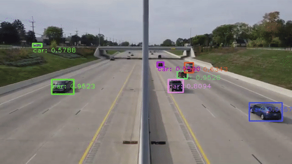

# Analyse d'image par IA : Utilisation de Yolov4



## Installation avec Anaconda

1. Créer un environnement virtuel vide

```
conda create -n myenv python pip --no-default-packages
```

2. Installer les dépendances
```
pip install -r requirements.txt
```

3. Télécharger les fichiers de Yolov4

- **cfg** : https://github.com/AlexeyAB/darknet/releases/download/darknet_yolo_v3_optimal/yolov4.cfg
- **weights** : https://github.com/AlexeyAB/darknet/releases/download/darknet_yolo_v3_optimal/yolov4.weights
- **Coco names** : https://github.com/pjreddie/darknet/blob/master/data/coco.names

3. Lancer le code
```
python main.py
```

## Utilisation sur une autre vidéo

Modifier le fichier `main.py` à la ligne 20 avec le nom du fichier contenant la vidéo à analyser.

```python
# initialize the video stream, pointer to output video file
cap = cv2.VideoCapture("video_test.mp4")
```

## Crédits 

Github original de `main.py` : https://github.com/Camebush/real-time-yolov4-object-detection

Vidéo téléchargée ici :
https://www.youtube.com/watch?v=KBsqQez-O4w